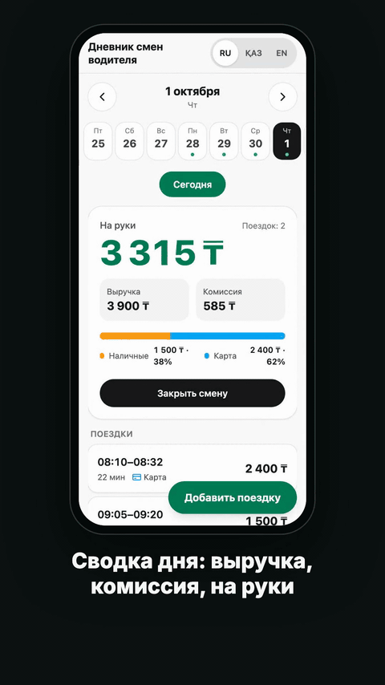
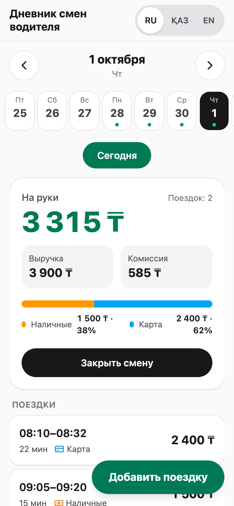
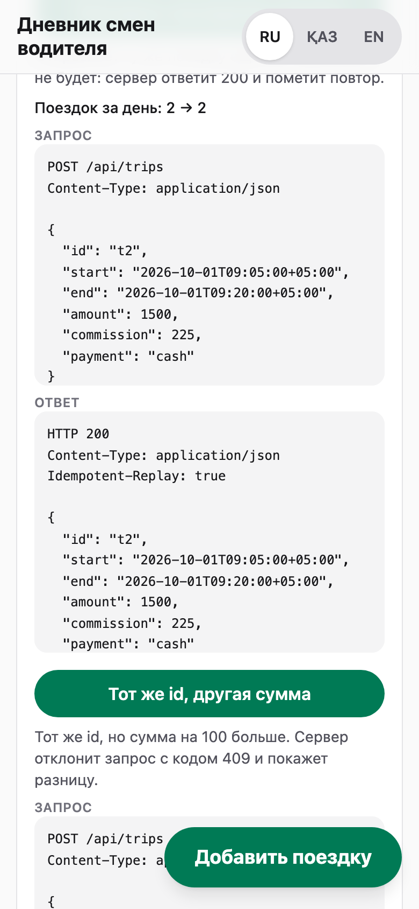
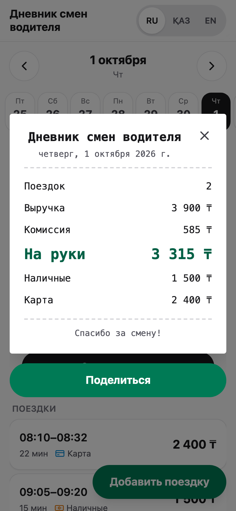

# Дневник смен водителя

<!-- TODO(Kair): после создания репозитория (сделано: <user> заменён на kayr-jpg) ссылки внизу файла (бейджи, видео, репозиторий); после первого деплоя — <your-subdomain> в ссылке [live]. Все ссылки-плейсхолдеры собраны в конце файла. -->

[![CI][ci-badge]][ci] [![Deploy][deploy-badge]][deploy]

<!-- TODO(Kair): бейдж покрытия добавить, когда CI начнёт публиковать отчёт о покрытии; пока цифры покрытия — только в разделе «Тесты» (локальный прогон). -->

Веб-приложение и API, которые превращают поездки водителя в сводку заработка за день: выручка, комиссия, «на руки», наличные/карта. Повторная отправка той же поездки не создаёт дубль.

- **Демо:** [`https://shift-diary.<your-subdomain>.workers.dev`][live] (Cloudflare Workers + D1) <!-- TODO(Kair): живой URL появится после первого деплоя, см. «Ограничения» -->
- **Видео (52 с):** [MP4 1080×1920][video] · [MP4 1920×1080][video-wide], прикреплены к последнему релизу <!-- TODO(Kair): файлы появятся после публикации релиза v1.0.0 (release-video.yml) -->
- **Журнал ИИ:** [`docs/AI_LOG.md`](docs/AI_LOG.md): где ИИ ошибся, как это поймали, каким коммитом исправили

[][video]

| Телефон | «Под капотом» после повтора (200) и конфликта (409) | Чек смены |
|---|---|---|
|  |  |  |

Остальные снимки лежат в [`docs/screenshots/`](docs/screenshots/): форма добавления, казахский интерфейс, десктоп. Их пересоздаёт `pnpm docs:screenshots`.

---

## Как запустить

### Вариант 1: открыть ссылку

[`https://shift-diary.<your-subdomain>.workers.dev`][live] <!-- TODO(Kair): живой URL --> Ничего ставить не нужно. Каждый посетитель получает свою «песочницу» с демо-данными: две поездки из брифа и ещё 12 поездок за 28.09–08.10.2026. Открыть день из брифа можно сразу по ссылке `/#2026-10-01`.

### Вариант 2: Docker (одна команда)

```bash
docker compose up --build
# → http://localhost:8787  (API и собранный клиент на одном порту; данные в volume shift-data)
```

Образ: Node 22 + SQLite (better-sqlite3), healthcheck по `/api/health`. Сброс данных: `docker compose down -v`.

### Вариант 3: из исходников

Нужны Node.js 22.18+ (скрипты `demo:record` и `docs:screenshots` запускают `.ts` напрямую через `node`, а type stripping включён по умолчанию с 22.18; CI использует 22, локально проверено на 24.15) и pnpm 12.10.1 из поля `packageManager`. Его подставляет corepack:

```bash
corepack enable          # если corepack ругается на подписи: npm i -g corepack@latest
pnpm i
pnpm dev
```

`pnpm dev` запускает параллельно:

| Процесс | Порт | Что делает |
|---|---|---|
| API (`tsx watch apps/api/src/node.ts`) | **8787** | Hono + SQLite, файл БД `apps/api/data/app.db` |
| Клиент (Vite) | **5173** | React-приложение; запросы `/api` проксируются на 8787 |

Откройте http://localhost:5173.

Собранный вариант, как в Docker: `pnpm build && pnpm --filter @shift/api start:node` → http://localhost:8787.

---

## Требования → доказательства

| # | Требование | Код | Тест, который это доказывает |
|---|---|---|---|
| R1 | API отдаёт поездки за выбранный день и сводку: количество, выручка, комиссия, «на руки», наличные/карта | [`apps/api/src/routes/read.ts`](apps/api/src/routes/read.ts#L12-L29) (`GET /api/trips?date=`), [`packages/core/src/summary.ts`](packages/core/src/summary.ts#L13-L27) (`summarize`), [`packages/core/src/time.ts`](packages/core/src/time.ts#L23-L29) (границы дня) | [`apps/api/test/get-trips.test.ts`](apps/api/test/get-trips.test.ts#L7): «2026-10-01 → exact brief summary, trips sorted by start»; «empty day → zero summary and no trips»; «midnight-crossing trip appears on its start day only» |
| R2 | Клиент показывает сводку и список поездок, умеет переключать дни | [`apps/web/src/App.tsx`](apps/web/src/App.tsx), [`SummaryCard.tsx`](apps/web/src/components/SummaryCard.tsx), [`TripList.tsx`](apps/web/src/components/TripList.tsx), [`DayStrip.tsx`](apps/web/src/components/DayStrip.tsx), [`DaySwipe.tsx`](apps/web/src/components/DaySwipe.tsx) | [`apps/web/test/App.test.tsx`](apps/web/test/App.test.tsx#L93): «opens the latest day with trips and shows the brief's summary and trips», «next-day arrow requests the next date…»; e2e в реальном браузере, [`e2e/tests/main-flow.spec.ts`](e2e/tests/main-flow.spec.ts): «arrows switch to the next day and back», «date strip selects a day» |
| R3 | Добавление поездки через API с валидацией (сумма > 0, конец > начала); повторная отправка той же поездки не создаёт дубль | [`apps/api/src/routes/trips.ts`](apps/api/src/routes/trips.ts#L35-L65) (`POST /api/trips`), [`packages/core/src/trip.ts`](packages/core/src/trip.ts#L56-L100) (общая Zod-схема для сервера и клиента), `insertIfAbsent` в [`repo.sqlite.ts`](apps/api/src/repo.sqlite.ts#L44-L59) / [`repo.d1.ts`](apps/api/src/repo.d1.ts#L44-L59) | [`apps/api/test/post-trips.test.ts`](apps/api/test/post-trips.test.ts#L13-L80): 201 → 200 replay → 409; [валидация 422](apps/api/test/post-trips.test.ts#L82-L122): 17 случаев, включая «end before start», «amount zero»; [«20 concurrent identical POSTs → exactly one 201, nineteen 200, one row»](apps/api/test/post-trips.test.ts#L223) |
| R4 | Тесты на расчёт сводки и защиту от дублей | — | Сводка: [`packages/core/test/summary.test.ts`](packages/core/test/summary.test.ts#L10) («sums the brief example»: 3 900 / 585 / 3 315 / 1 500 / 2 400) и property-тесты [`summary.property.test.ts`](packages/core/test/summary.property.test.ts#L66) (fast-check, 300 прогонов на свойство). Дубли: [`post-trips.test.ts`](apps/api/test/post-trips.test.ts#L13), [`repo.contract.ts`](apps/api/test/repo.contract.ts#L60) (один контракт для SQLite и D1/Miniflare), e2e [`idempotency.spec.ts`](e2e/tests/idempotency.spec.ts#L81) по реальному HTTP |

---

## Решения

| Решение | Почему |
|---|---|
| **День — календарная дата по фиксированному UTC+05:00.** Поездка относится к дню своего *начала*: поездка 23:50–00:20 попадает в первый день. `dayRange("2026-10-01")` = `[2026-10-01T00:00+05:00, 2026-10-02T00:00+05:00)` | С марта 2024 года в Казахстане единый пояс UTC+5 без перехода на летнее время. Поэтому в `core` зашит фиксированный `+05:00`, а не `Asia/Almaty`: в старых браузерах и ОС с устаревшей базой часовых поясов `Asia/Almaty` всё ещё +06:00, и поездки молча переезжали бы между днями. Клиент тоже считает время от `+05:00`, а не от часового пояса устройства (это проверяет тест с `TZ=America/New_York`). |
| **`id` поездки — ключ идемпотентности внутри песочницы.** Новый id → **201**; тот же id и тот же payload → **200** + `Idempotent-Replay: true` и сохранённая поездка; тот же id, другой payload → **409** `ID_CONFLICT` с `diff`; неверный payload → **422** со всеми кодами ошибок | Клиент может безопасно повторить POST после обрыва сети: повтор не создаёт дубль, а конфликт виден явно, без молчаливой перезаписи. «Тот же payload» сравнивается после `canonicalize()`: время приводится к UTC-моменту, так что `08:10+05:00` и `03:10Z` — одна и та же поездка. Вставка — один атомарный `INSERT … ON CONFLICT (sandbox_id, id) DO NOTHING` с последующим чтением, поэтому 20 одновременных одинаковых запросов дают ровно одну строку. |
| **Пересекающиеся поездки принимаются с предупреждением** `warnings: [{ code: "OVERLAP", with: "<id>" }]`, в интерфейсе появляется бейдж | Бриф не запрещает пересечения. Отказ мог бы сломать корректный тест проверяющего, а водитель мог просто ошибиться со временем: предупреждение полезнее, чем 422. Соседей ищем в окне ±12 ч вокруг дня, потому что поездка длится не больше 12 ч. |
| **Деньги — целые тенге** (`amount`, `commission` — целые, 0 ≤ комиссия ≤ сумма) | Float нигде не используется: целые суммы складываются точно, без ошибок округления. Property-тесты проверяют `net = revenue − commission` и `cash + card = revenue` на случайных данных. |
| **Песочницы.** Первый запрос к настоящему маршруту (`/api/trips`, `/api/days`, `/api/sandbox/reset`) без песочницы создаёт новую, заполненную демо-данными, и ставит cookie `sid` (HttpOnly, SameSite=Lax, 7 дней). Для curl и API-клиентов есть заголовок `X-Sandbox-Id`: id приходит в одноимённом заголовке ответа. Неизвестный или испорченный id → новая песочница. Неизвестные пути, неподдерживаемые методы и тела больше 16 КБ отклоняются раньше, без записи в БД; `last_seen` обновляется не чаще раза в час. Песочницы, к которым не обращались 7 дней, удаляются: Cron Trigger на Workers раз в сутки, в Node раз в 6 ч | Публичное демо без авторизации: проверяющие не видят и не ломают данные друг друга, «Сбросить демо» возвращает исходное состояние. Заголовок вместо cookie удобен скриптам и ИИ-проверяющим. |
| **Cloudflare D1 в проде, SQLite (better-sqlite3) локально и в Docker** | Один SQL-диалект (SQLite) везде и одна схема и миграции Drizzle. D1 бесплатен, не «засыпает», и API со статикой живут в одном Worker на одном URL. Маршруты работают только через интерфейс `TripRepository`, а один и тот же контрактный тест гоняется на обеих реализациях (D1 — через Miniflare). |

---

## API

Базовый URL: `https://shift-diary.<your-subdomain>.workers.dev` <!-- TODO(Kair): живой URL --> или `http://localhost:8787` локально.

| Метод | Путь | Ответ |
|---|---|---|
| GET | `/api/trips?date=YYYY-MM-DD` | `{ date, timezone: "+05:00", summary, trips[] }`, поездки по времени начала; плохая дата → 422 `DATE_INVALID` |
| GET | `/api/days` | `{ days: [{ date, tripCount }] }` |
| POST | `/api/trips` | 201 / 200 replay / 409 / 422 (см. выше); тело больше 16 КБ → 413 `BODY_TOO_LARGE` |
| POST | `/api/sandbox/reset` | 204, вернуть демо-данные |
| GET | `/api/health` | `{ ok: true, version, commit }` |
| любой | другой путь или метод под `/api/` | 404 `{ "code": "NOT_FOUND" }`; песочница не создаётся, cookie не ставится |

Примеры ниже выполнены против локального сервера (`apps/api/src/node.ts` на :8787, чистая временная БД). Ответы настоящие. Из заголовков ответа оставлены статус и значимые заголовки; `Date`, `Content-Length`, `Connection`, `Keep-Alive` и повторяющийся `set-cookie` убраны.

**Получить песочницу.** Любой запрос к `/api/*`, кроме `/api/health`, без cookie и заголовка создаёт новую песочницу:

```console
$ BASE=http://localhost:8787
$ SID=$(curl -s -o /dev/null -D - "$BASE/api/days" | awk 'tolower($1)=="x-sandbox-id:" {print $2}' | tr -d "\r"); echo "$SID"
39f990e45e498d5ea5ae444381748fa0
```

**201: новая поездка**

```console
$ curl -si -X POST "$BASE/api/trips" -H "X-Sandbox-Id: $SID" -H "Content-Type: application/json" \
    -d '{"id":"t100","start":"2026-10-01T10:00:00+05:00","end":"2026-10-01T10:30:00+05:00","amount":1000,"payment":"card","commission":150}'
HTTP/1.1 201 Created
content-type: application/json
x-sandbox-id: 39f990e45e498d5ea5ae444381748fa0

{"id":"t100","start":"2026-10-01T10:00:00+05:00","end":"2026-10-01T10:30:00+05:00","amount":1000,"commission":150,"payment":"card"}
```

**200: тот же запрос ещё раз, дубль не создан**

```console
$ curl -si -X POST "$BASE/api/trips" -H "X-Sandbox-Id: $SID" -H "Content-Type: application/json" \
    -d '{"id":"t100","start":"2026-10-01T10:00:00+05:00","end":"2026-10-01T10:30:00+05:00","amount":1000,"payment":"card","commission":150}'
HTTP/1.1 200 OK
content-type: application/json
idempotent-replay: true
x-sandbox-id: 39f990e45e498d5ea5ae444381748fa0

{"id":"t100","start":"2026-10-01T10:00:00+05:00","end":"2026-10-01T10:30:00+05:00","amount":1000,"commission":150,"payment":"card"}
```

Тот же момент времени в другой записи (`Z` вместо `+05:00`) — тоже повтор. Сервер возвращает первую сохранённую форму:

```console
$ curl -si -X POST "$BASE/api/trips" -H "X-Sandbox-Id: $SID" -H "Content-Type: application/json" \
    -d '{"id":"t100","start":"2026-10-01T05:00:00Z","end":"2026-10-01T05:30:00Z","amount":1000,"payment":"card","commission":150}'
HTTP/1.1 200 OK
content-type: application/json
idempotent-replay: true
x-sandbox-id: 39f990e45e498d5ea5ae444381748fa0

{"id":"t100","start":"2026-10-01T10:00:00+05:00","end":"2026-10-01T10:30:00+05:00","amount":1000,"commission":150,"payment":"card"}
```

**409: тот же id, другая сумма**

```console
$ curl -si -X POST "$BASE/api/trips" -H "X-Sandbox-Id: $SID" -H "Content-Type: application/json" \
    -d '{"id":"t100","start":"2026-10-01T10:00:00+05:00","end":"2026-10-01T10:30:00+05:00","amount":1100,"payment":"card","commission":150}'
HTTP/1.1 409 Conflict
content-type: application/json
x-sandbox-id: 39f990e45e498d5ea5ae444381748fa0

{"code":"ID_CONFLICT","diff":{"amount":[1000,1100]}}
```

**422: все ошибки сразу**

```console
$ curl -si -X POST "$BASE/api/trips" -H "X-Sandbox-Id: $SID" -H "Content-Type: application/json" \
    -d '{"id":"t 101","start":"2026-10-01T11:00:00+05:00","end":"2026-10-01T10:00:00+05:00","amount":0,"payment":"crypto","commission":-1}'
HTTP/1.1 422 Unprocessable Entity
content-type: application/json
x-sandbox-id: 39f990e45e498d5ea5ae444381748fa0

{"errors":[{"field":"id","code":"ID_INVALID"},{"field":"amount","code":"AMOUNT_INVALID"},{"field":"commission","code":"COMMISSION_INVALID"},{"field":"payment","code":"PAYMENT_INVALID"},{"field":"end","code":"END_BEFORE_START"}]}
```

**201 с предупреждением о пересечении** (08:20–08:40 пересекается с `t1` 08:10–08:32):

```console
$ curl -si -X POST "$BASE/api/trips" -H "X-Sandbox-Id: $SID" -H "Content-Type: application/json" \
    -d '{"id":"t102","start":"2026-10-01T08:20:00+05:00","end":"2026-10-01T08:40:00+05:00","amount":800,"payment":"cash","commission":120}'
HTTP/1.1 201 Created
content-type: application/json
x-sandbox-id: 39f990e45e498d5ea5ae444381748fa0

{"id":"t102","start":"2026-10-01T08:20:00+05:00","end":"2026-10-01T08:40:00+05:00","amount":800,"commission":120,"payment":"cash","warnings":[{"code":"OVERLAP","with":"t1"}]}
```

**GET: день** (две поездки брифа + `t102` + `t100`)

```console
$ curl -s "$BASE/api/trips?date=2026-10-01" -H "X-Sandbox-Id: $SID"
{"date":"2026-10-01","timezone":"+05:00","summary":{"tripCount":4,"revenue":5700,"commission":855,"net":4845,"cash":2300,"card":3400},"trips":[{"id":"t1","start":"2026-10-01T08:10:00+05:00","end":"2026-10-01T08:32:00+05:00","amount":2400,"commission":360,"payment":"card","durationMinutes":22,"warnings":[{"code":"OVERLAP","with":"t102"}]},{"id":"t102","start":"2026-10-01T08:20:00+05:00","end":"2026-10-01T08:40:00+05:00","amount":800,"commission":120,"payment":"cash","durationMinutes":20,"warnings":[{"code":"OVERLAP","with":"t1"}]},{"id":"t2","start":"2026-10-01T09:05:00+05:00","end":"2026-10-01T09:20:00+05:00","amount":1500,"commission":225,"payment":"cash","durationMinutes":15},{"id":"t100","start":"2026-10-01T10:00:00+05:00","end":"2026-10-01T10:30:00+05:00","amount":1000,"commission":150,"payment":"card","durationMinutes":30}]}

$ curl -si "$BASE/api/trips?date=2026-13-01" -H "X-Sandbox-Id: $SID"
HTTP/1.1 422 Unprocessable Entity
content-type: application/json
x-sandbox-id: 39f990e45e498d5ea5ae444381748fa0

{"errors":[{"field":"date","code":"DATE_INVALID"}]}
```

**GET: дни с поездками**

```console
$ curl -s "$BASE/api/days" -H "X-Sandbox-Id: $SID"
{"days":[{"date":"2026-09-28","tripCount":2},{"date":"2026-09-29","tripCount":2},{"date":"2026-09-30","tripCount":2},{"date":"2026-10-01","tripCount":4},{"date":"2026-10-02","tripCount":1},{"date":"2026-10-03","tripCount":1},{"date":"2026-10-05","tripCount":1},{"date":"2026-10-06","tripCount":1},{"date":"2026-10-07","tripCount":1},{"date":"2026-10-08","tripCount":1}]}
```

**Сброс песочницы и снова сводка из брифа** (3 900 / 585 / 3 315 / 1 500 / 2 400)

```console
$ curl -si -X POST "$BASE/api/sandbox/reset" -H "X-Sandbox-Id: $SID"
HTTP/1.1 204 No Content
x-sandbox-id: 39f990e45e498d5ea5ae444381748fa0

$ curl -s "$BASE/api/trips?date=2026-10-01" -H "X-Sandbox-Id: $SID"
{"date":"2026-10-01","timezone":"+05:00","summary":{"tripCount":2,"revenue":3900,"commission":585,"net":3315,"cash":1500,"card":2400},"trips":[{"id":"t1","start":"2026-10-01T08:10:00+05:00","end":"2026-10-01T08:32:00+05:00","amount":2400,"commission":360,"payment":"card","durationMinutes":22},{"id":"t2","start":"2026-10-01T09:05:00+05:00","end":"2026-10-01T09:20:00+05:00","amount":1500,"commission":225,"payment":"cash","durationMinutes":15}]}
```

**Health**

```console
$ curl -s "$BASE/api/health"
{"ok":true,"version":"dev","commit":"dev"}
```

В проде `version` и `commit` подставляет `deploy.yml`, а после деплоя проверяется, что `commit` совпадает с задеплоенным SHA.

---

## Тесты

| Слой | Инструмент | Что покрывает | Файлы | Тестов |
|---|---|---|---|---|
| Unit (core) | Vitest | Пример брифа, пустой день, только наличные / только карта, поездка через полночь, 02:00 по местному времени против UTC-даты, каждое правило валидации, `canonicalize`, границы дня | `packages/core/test/{summary,trip,time,canonical}.test.ts` | 79 |
| Property (core) | fast-check, 300 прогонов на свойство | `net = revenue − commission`; `cash + card = revenue`; сумма дневных сводок = сводке всех поездок; `canonicalize` идемпотентен и не зависит от записи смещения | `packages/core/test/summary.property.test.ts` | 5 |
| API | Vitest + Hono `app.request` + SQLite в памяти; D1 через Miniflare | 201 → 200 → 409, все 422, изоляция песочниц, reset, 413, 500 без стектрейса, JSON 404 без создания песочницы, **20 одновременных одинаковых POST → 1 строка**, контракт репозитория на SQLite и D1, Worker и cron | `apps/api/test/*.test.ts` (9 файлов) | 112 |
| Web | Vitest + Testing Library (jsdom) | Главный экран, переключение дней и свайп, форма добавления (включая поездку через полночь), «Под капотом», чек и PNG, офлайн, i18n (совпадение ключей), формат денег, PWA-манифест | `apps/web/test/*` (12 файлов) | 88 |
| E2E + a11y | Playwright (iPhone 14 / WebKit и Desktop Chrome) + axe-core | Переключение дней, добавление поездки (и через полночь), повтор/409/422 в панели, KZ/EN, чек, PWA, axe без serious/critical, тап-цели ≥ 44 px, reduced motion | `e2e/tests/*.spec.ts` | 59 passed, 3 skipped |
| Smoke | Playwright против прода | Health, сводка из демо-данных, 201 → 200 → 409 по HTTP, добавление поездки в UI, статика/манифест/SW; запускается после каждого деплоя | `e2e/tests/smoke.spec.ts` | 5 |

Цифры из прогона после финального раунда исправлений (коммиты `e6d033e..`, см. «Как я использовал ИИ»): `pnpm test` → core 84, api 112, web 88 (284, все зелёные); `pnpm e2e` → 59 passed, 3 skipped (iPhone/WebKit 28 + 3 skipped, Desktop 31). Пропущены 3 теста, которые требуют Chromium (service worker и скачивание PNG). Smoke-тесты входят в `pnpm e2e` (5 × 2 проекта). Покрытие (`vitest run --coverage`): `packages/core` — 100 % строк, 93.9 % веток; `apps/api` — 99.34 % строк, 89.41 % веток.

```bash
pnpm typecheck && pnpm lint && pnpm test       # типы, ESLint, unit + property + API + web
pnpm build                                     # нужен для e2e: сервер отдаёт apps/web/dist
pnpm --filter @shift/e2e install-browsers      # один раз: chromium + webkit
pnpm e2e                                       # сам поднимет сервер на :8787 с временной БД
BASE_URL=https://shift-diary.<your-subdomain>.workers.dev pnpm smoke   # smoke против прода
pnpm --filter @shift/core exec vitest run --coverage                  # покрытие (так же для @shift/api)
```

CI (`.github/workflows/ci.yml`, на каждый PR и push в `main`): установка → typecheck → lint → test → build, затем e2e и сборка Docker-образа со smoke-проверкой контейнера.

---

## Как я использовал ИИ

Весь код, тесты, конфиги и эта документация написаны **Claude Code**. Я задавал направление, утверждал документы и принимал решения на контрольных точках. Руками код не правил.

**Процесс:**

1. **Спека.** Обсуждение с Claude превратилось в спеку: [`docs/superpowers/specs/2026-10-08-shift-diary-design.md`](docs/superpowers/specs/2026-10-08-shift-diary-design.md). Я её утвердил.
2. **План.** 17 задач в 4 фазах (core → API → web → доставка): [`docs/superpowers/plans/2026-10-08-shift-diary.md`](docs/superpowers/plans/2026-10-08-shift-diary.md).
3. **Исполнение.** Управляющая сессия на каждую задачу запускала свежего агента-исполнителя (строго TDD: сначала красный тест, потом код), а затем **независимого агента-ревьюера** на диф задачи. Находки уровня Important/Critical уходили исполнителю отдельным раундом исправлений, после которого шло повторное ревью. Minor-находки записывались в ledger как отложенные.
4. **Судьи вне модели.** Тесты (включая property-тесты), Playwright + axe в реальных браузерах, настоящий `docker compose up` и `wrangler dev`. Ревьюер может ошибиться, а тест в браузере — нет.

**Что получилось в цифрах** (из `git log` и ledger):

- От коммита спеки до README (`e829209..3918732`) — 27 коммитов; 7 из них — `fix(...)`, и каждый закрывает находку ревью или упавшего теста.
- Раунды исправлений после ревью понадобились в 7 задачах из 17 (6, 9, 11, 12, 14, 16, 17).
- Финальное ревью всей ветки (`e829209..e6d033e`, 29 коммитов) нашло 3 Important и 5 Minor. Главные: форма не давала сохранить поездку через полночь (23:40 → 00:15), а любой запрос к `/api/*` без cookie, даже к несуществующему пути, создавал и заполнял песочницу. Всё закрыто одним раундом исправлений: `30f6727`, `42ecff3`, `dcda2d1`, `9749174` и коммит с этой правкой документации.
- Один раз ошибся сам ревьюер: в задаче 2 он посчитал баг валидации «намеренным». Баг поймал тест формы в задаче 9, и задачу 2 переоткрыли.
- Самый поучительный случай — Docker (задача 14). Исполнитель не мог запустить Docker и сдал работу с «симуляцией». Ревью пометило Critical: старый corepack и тег `node:22.12`, скорее всего, ломают сборку. При подготовке этой документации исходный Dockerfile (коммит `2f37a13`) собрали заново. Сборка действительно падает на `corepack prepare pnpm@12.10.1` (`Internal Error: Cannot find matching keyid`). Если обновить только corepack, образ на `node:22.12` собирается, но сервер падает с `Segmentation fault` при открытии SQLite (better-sqlite3). Подробности — в AI_LOG.

Подробно, со всеми случаями, SHA и тем, как их поймали: **[`docs/AI_LOG.md`](docs/AI_LOG.md)**.

<!-- TODO(Kair): подтвердить, что красные тесты сводки (коммит 82a1032, «test(core): summary and property tests (red)») ты просмотрел, как требует спека §9; если да, можно добавить сюда одну строку об этом. -->

---

## Что бы я сделал дальше

- **Авторизация и несколько водителей.** Песочница уже изолирует данные, так что её `id` можно заменить на id водителя или парка.
- **Редактирование и удаление поездок** с журналом изменений. Сейчас конфликт 409 — единственный способ узнать о расхождении.
- **Офлайн-очередь записей.** Сохранять POST в IndexedDB и досылать при появлении сети. Повтор безопасен благодаря тому же ключу идемпотентности (`id`), поэтому отдельный протокол синхронизации не нужен.
- **Нативное приложение** (React Native / Expo) с общим `@shift/core`: схемы, валидация и сводка уже не зависят от платформы.
- **Казахский перевод** должен проверить носитель языка: сейчас это лучшая попытка ИИ (например, «Қолға» для «На руки»).
- **Наблюдаемость.** Сейчас Worker пишет структурные JSON-логи. Дальше — метрики (доля 409/422, задержки D1), алерты и трассировка запросов по `X-Sandbox-Id`.
- Закрыть отложенные minor-находки ревью, перечисленные в конце [`docs/AI_LOG.md`](docs/AI_LOG.md).

---

## Структура репозитория

```
packages/core/      чистая логика без I/O: Zod-схема поездки, границы дня (+05:00), canonicalize, пересечения, summarize
apps/api/           Hono-приложение; TripRepository с двумя реализациями: D1 (Worker) и better-sqlite3 (Node/Docker)
  src/worker.ts     вход для Cloudflare Workers (+ cron-очистка песочниц)
  src/node.ts       вход для Node/Docker (раздаёт и собранный клиент)
  migrations/       миграции Drizzle (общие для D1 и SQLite)
apps/web/           React + Vite PWA: главный экран, форма, «Под капотом», чек смены, RU/KZ/EN
e2e/                Playwright: тесты, smoke, запись футажа для видео, снимки экрана (demo/)
video/              Remotion: демо-видео 52 с (1080×1920 и 1920×1080)
data/trips.json     демо-данные: 14 поездок за 28.09–08.10, включая две поездки брифа
docs/               спека, план, AI_LOG.md, скриншоты, demo.gif
.github/workflows/  ci.yml, deploy.yml, release-video.yml
Dockerfile, docker-compose.yml, wrangler.jsonc
```

---

## Ограничения

- **Вне рамок по спеке:** авторизация, несколько водителей, офлайн-синхронизация записей, редактирование и удаление поездок, нативные приложения.
- **Прод ещё не развёрнут.** Живой URL, бейджи и видео в этом README пока плейсхолдеры. Код деплоя готов. Проверен только локально, в задаче 15: `wrangler dev --local` + smoke 5/5. Ни в CI, ни против прода smoke ещё не запускался. Для первого деплоя нужна разовая настройка (шаги из шапки `.github/workflows/deploy.yml`):
  1. Создать базу D1: `pnpm exec wrangler d1 create shift-diary`.
  2. Вписать выданный `database_id` в `wrangler.jsonc` вместо `REPLACE_WITH_D1_ID` и закоммитить.
  3. GitHub → Settings → Secrets and variables → Actions → **Secrets**: `CLOUDFLARE_API_TOKEN` (права «Edit Cloudflare Workers» и «D1:Edit») и `CLOUDFLARE_ACCOUNT_ID`.
  4. Там же → **Variables**: `PRODUCTION_URL = https://shift-diary.<your-subdomain>.workers.dev`, без слэша в конце (URL печатает первый `wrangler deploy`).

  После этого каждый push в `main` выполняет: миграции D1 → `wrangler deploy` → ожидание нужного `commit` в `/api/health` → smoke-тест против прода.
- **Видео к релизу.** `release-video.yml` рендерит MP4 и прикрепляет к опубликованному релизу. Сначала замените плейсхолдеры `LIVE_URL` / `REPO_URL` в `video/src/config.ts`: иначе воркфлоу остановится. Локально видео рендерится командами `pnpm build && pnpm demo:record && pnpm video:render`.
- **Docker-образ** собирался и проверялся локально (Colima): нативно на arm64 (`compose up --wait` → healthy, сводка, e2e против контейнера 47 passed / 3 skipped, данные сохраняются в volume, процесс работает не от root) и для amd64 через `docker buildx --platform linux/amd64`. После финального раунда исправлений (corepack закреплён на 0.36.0) образ снова собран с нуля и запущен (arm64): healthy, сводка за 2026-10-01 верна, `/api/nope` → JSON 404, e2e Desktop против контейнера 31 passed. Задание `docker` в CI на GitHub ещё не запускалось: репозиторий пока не опубликован.
- **Воркфлоу GitHub Actions** (`ci.yml`, `deploy.yml`, `release-video.yml`) написаны, но на GitHub ещё не запускались.
- **Не сделано из спеки: ревью PR через Claude GitHub Action** (§2, §10). Нужен ваш ключ API, поэтому воркфлоу не добавлен. Разовая настройка:
  1. В Claude Code выполнить `/install-github-app` (или вручную установить GitHub App Claude на репозиторий).
  2. GitHub → Settings → Secrets and variables → Actions → **Secrets**: `ANTHROPIC_API_KEY`.
  3. Добавить `.github/workflows/claude-review.yml` с `on: pull_request` и шагом `uses: anthropics/claude-code-action@v1` (`anthropic_api_key: ${{ secrets.ANTHROPIC_API_KEY }}`, `prompt: "Review this PR"`), права `contents: read`, `pull-requests: write`.
- **Не сделано из спеки: комментарий о покрытии в PR и бейдж покрытия** (§10, §12). Покрытие считается локально (`vitest run --coverage`, цифры выше), но в CI не публикуется. Разовая настройка: в `ci.yml` запускать `pnpm --filter @shift/core exec vitest run --coverage --coverage.reporter=json-summary --coverage.reporter=json` (так же для `@shift/api`), затем шаг `davelosert/vitest-coverage-report-action@v2` с `working-directory: packages/core` (и второй — для `apps/api`) и правом `pull-requests: write` у задания. Секреты не нужны: хватает `GITHUB_TOKEN`.
- **Нет ограничения частоты запросов.** Каждый новый посетитель без cookie создаёт песочницу (15 вставок: сама песочница и 14 демо-поездок; D1 считает и записи индексов), поэтому скрипт может выбрать бесплатную квоту записей D1. Перед тем как делиться публичным URL, включите rate limiting: правило WAF Rate Limiting в Cloudflare (например, на `/api/*`) или биндинг Workers Rate Limiting с ключом по `cf-connecting-ip`. Биндинг в этом репозитории не реализован.
- `vite-plugin-pwa` закреплён на 1.3.0: версия 2.0.0 вышла меньше двух недель назад.

<!-- Ссылки. TODO(Kair): <your-subdomain> — на поддомен workers.dev (тот же, что в video/src/config.ts). -->
[live]: <https://shift-diary.\<your-subdomain\>.workers.dev>
[ci]: <https://github.com/kayr-jpg/shift-diary/actions/workflows/ci.yml>
[ci-badge]: <https://github.com/kayr-jpg/shift-diary/actions/workflows/ci.yml/badge.svg>
[deploy]: <https://github.com/kayr-jpg/shift-diary/actions/workflows/deploy.yml>
[deploy-badge]: <https://github.com/kayr-jpg/shift-diary/actions/workflows/deploy.yml/badge.svg>
[video]: <https://github.com/kayr-jpg/shift-diary/releases/latest/download/shift-diary-1080x1920.mp4>
[video-wide]: <https://github.com/kayr-jpg/shift-diary/releases/latest/download/shift-diary-1920x1080.mp4>
